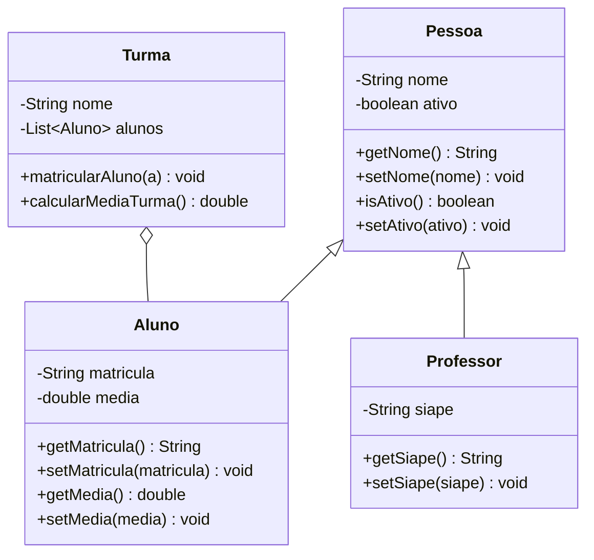

```mermaid
classDiagram
    class Pessoa {
        -String nome
        -boolean ativo
        +getNome() String
        +setNome(nome) void
        +isAtivo() boolean
        +setAtivo(ativo) void
    }
    class Aluno {
        -String matricula
        -double media
        +getMatricula() String
        +setMatricula(matricula) void
        +getMedia() double
        +setMedia(media) void
    }
    class Professor {
        -String siape
        +getSiape() String
        +setSiape(siape) void
    }
    class Turma {
        -String nome
        -List~Aluno~ alunos
        +matricularAluno(a) void
        +calcularMediaTurma() double
    }
    Pessoa <|-- Aluno
    Pessoa <|-- Professor
    Turma o-- Aluno
```